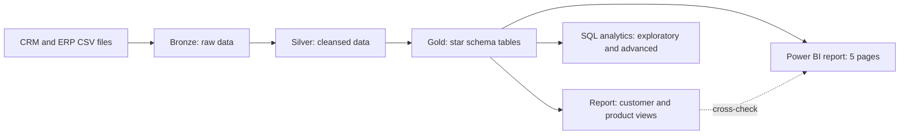
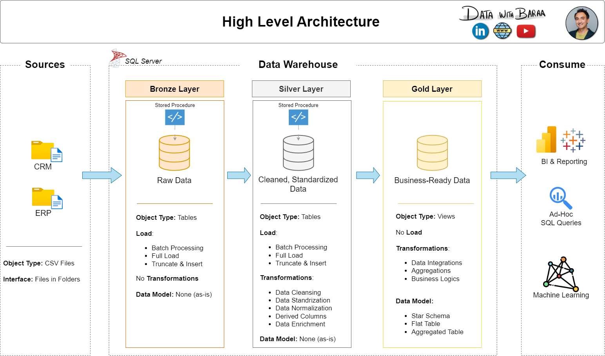
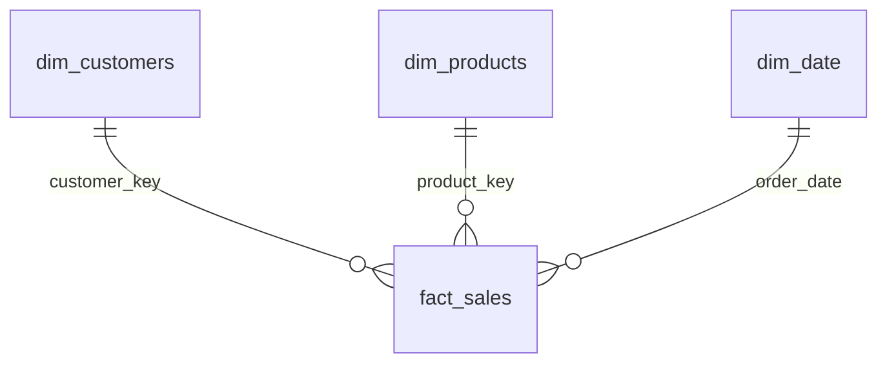

# Bike Sales Analytics: An End-to-End Data Project with SQL Server & Power BI


From raw CRM and ERP CSV files to an interactive Power BI report. The repository covers the full data journey:

1. **Data Warehouse**: an ETL pipeline in SQL Server (Bronze → Silver → Gold) that consolidates two source systems into a star schema.
2. **Data Analytics**: exploratory and advanced T-SQL analysis, plus a report layer of customer and product views.
3. **Power BI Report**: a five-page interactive report built on the Gold star schema, reconciled against the SQL results.

> [!IMPORTANT]
> **Before you run the pipeline, set your own CSV path.** `scripts/02_bronze_layer/03_proc_load_bronze.sql` still contains a **hard-coded absolute path** from the author's machine. Replace it with the location of the CSV files on **your** machine, otherwise the Bronze load fails. See [Getting Started, step 2](#2-set-the-csv-path-required).

---

## Table of Contents

- [Project Flow](#project-flow)
- [Key Findings](#key-findings)
- [Architecture](#architecture)
- [Data Model](#data-model)
- [Repository Structure](#repository-structure)
- [Getting Started](#getting-started)
- [SQL Analytics](#sql-analytics)
- [Power BI Report](#power-bi-report)
- [Data Quality and Engineering Notes](#data-quality-and-engineering-notes)
- [Modifications from the Original Course Project](#modifications-from-the-original-course-project)
- [Limitations](#limitations)
- [Documentation](#documentation)
- [Acknowledgements](#acknowledgements)
- [License](#license)
- [Author](#author)

---

## Project Flow



**Business goal:** consolidate sales data from two source systems into one trusted model, then use it to understand sales trends, product performance and customer behavior.

**Tech stack:** SQL Server (T-SQL, stored procedures, views, window functions), SSMS, Power BI (DAX), Git.

**Scope:** latest snapshot only, no historization. Every load is a full reload.

---

## Key Findings

Figures come from the Gold layer (order dates from 29 Dec 2010 to 28 Jan 2014).

| Topic | Finding |
|---|---|
| Scale | 29,356,250 total sales, 27,659 orders, 18,484 customers, 295 products (130 ever sold) |
| Category mix | Bikes contribute 96.5% of sales, Accessories 2.4%, Clothing 1.2%. Road Bikes alone are 49.5% |
| Unsold products | 165 of 295 products were never sold, including all 127 Components |
| Growth | Sales fell 17.4% from 2011 to 2012, then rose 179.8% in 2013 (16.34M, 55.7% of the total), driven by order volume (3,269 → 21,287 orders) |
| Order value | Average order value fell from about 3,193 (2011) to 768 (2013) as accessories and clothing lines began to sell (1.00 → 2.48 lines per order) |
| Markets | United States (31.2%) and Australia (30.9%) account for 62.1% of sales |
| Customers | 37.1% of customers ordered more than once, and 1,655 customers (9.0%) qualify as VIP |
| Margin | Estimated gross margin is 39.8% overall (Accessories about 62.8%, Bikes about 39.2%), using each product's latest cost |

---

## Architecture

One database, `DataWarehouse`, with one schema per layer.



| Layer | Schema | Content | Object type | Load |
|---|---|---|---|---|
| Bronze | `bronze` | Raw data exactly as in the CSV files | Tables | `EXEC bronze.load_bronze` (`BULK INSERT`) |
| Silver | `silver` | Cleansed and standardized data | Tables | `EXEC silver.load_silver` |
| Gold | `gold` | Business-ready star schema | Tables | `EXEC gold.load_gold` |
| Report | `report` | Pre-aggregated customer and product reports | Views | None (always up to date) |

**Why Gold is made of tables:** surrogate keys are generated once per load and stay stable between queries, joins are not recomputed on every read (faster analysis and Power BI refresh), and primary and foreign keys enforce the model. The Gold load runs in a single transaction, so a failed load rolls back cleanly. The Report layer stays as views because it holds no data of its own.


**Sources:** CRM (`cust_info`, `prd_info`, `sales_details`) and ERP (`CUST_AZ12`, `LOC_A101`, `PX_CAT_G1V2`).

---

## Data Model

Star schema in the Gold layer:

| Table | Role | Description |
|---|---|---|
| `gold.fact_sales` | Fact | One row per order line: sales amount, quantity, price, order / shipping / due date |
| `gold.dim_customers` | Dimension | CRM customers enriched with ERP gender, birthdate and country |
| `gold.dim_products` | Dimension | Current CRM products enriched with ERP category, subcategory and maintenance flag |
| `gold.dim_date` | Dimension | Calendar table covering every fact date, used for time intelligence |

The diagram below shows the core of the model (the fact table and its two business dimensions). `gold.dim_date` is the calendar table added on top of it.


Report views in the `report` schema:

- `report.customers`: one row per customer, with age group, VIP / Regular / New segment, recency and spend KPIs.
- `report.products`: one row per product, with High-Performer / Mid-Range / Low-Performer segment and revenue KPIs.

Column-level details are in the [data catalog](docs/data_catalog.md).

---

## Repository Structure

```
bike-sales-analytics-end-to-end/
├── datasets/                          # Source CSV files
│   ├── source_crm/                    #   cust_info, prd_info, sales_details
│   └── source_erp/                    #   CUST_AZ12, LOC_A101, PX_CAT_G1V2
├── docs/                              # Architecture, data flow, model, catalog, naming conventions
├── scripts/
│   ├── 00_run_all.sql                 # Run order and one-click refresh of the warehouse
│   ├── 01_init_database/              # Database and schemas
│   ├── 02_bronze_layer/               # DDL + load procedure (CSV -> bronze)
│   │   └── 03_proc_load_bronze.sql    #   <- set your CSV path here (see Getting Started)
│   ├── 03_silver_layer/               # DDL + load procedure (bronze -> silver)
│   ├── 04_gold_layer/                 # DDL + load procedure (silver -> gold star schema)
│   ├── 05_report_layer/               # report.customers, report.products
│   └── 06_data_analytics/             # Exploratory and advanced analysis queries
├── tests/                             # Data quality checks (silver and gold)
├── powerbi/                           # Power BI report, theme and screenshots
│   ├── bike-sales-analytics.pbix
│   ├── bike_sales_theme.json
│   └── screenshots/
├── .gitignore
├── LICENSE
└── README.md
```

---

## Getting Started

**Requirements**

- SQL Server 2022 or later (`DATETRUNC` is used in `10_advanced_analysis.sql`) and SQL Server Management Studio (SSMS)
- Power BI Desktop (Windows), only needed to open or rebuild the report

### 1. Clone the repository

```bash
git clone https://github.com/<your-username>/bike-sales-analytics-end-to-end.git
```

### 2. Set the CSV path (required)

> [!IMPORTANT]
> The Bronze load procedure reads the CSV files with `BULK INSERT` and an **absolute path that is hard-coded to the author's machine**. It appears **6 times** in `scripts/02_bronze_layer/03_proc_load_bronze.sql` (lines 40, 57, 72, 91, 106 and 121):
>
> ```
> C:\DNA\Portfolio\bike-sales-analytics-end-to-end_v3\bike-sales-analytics-end-to-end
> ```
>
> Replace this base path with the folder where **you** cloned the repository, so that it points to your own CSV files.

1. Find the full path of your clone. In File Explorer, hold **Shift**, right-click the repository folder and choose **Copy as path** (for example `D:\projects\bike-sales-analytics-end-to-end`).
2. Open `scripts/02_bronze_layer/03_proc_load_bronze.sql` in SSMS and press **Ctrl + H** (Find and Replace).
3. **Find what:** `C:\DNA\Portfolio\bike-sales-analytics-end-to-end_v3\bike-sales-analytics-end-to-end`
   **Replace with:** the path of your clone, without quotes and without a trailing backslash.
4. Click **Replace All** (6 occurrences), then execute the file to update the procedure.

Example of one line before and after:

```sql
-- before
FROM 'C:\DNA\Portfolio\bike-sales-analytics-end-to-end_v3\bike-sales-analytics-end-to-end\datasets\source_crm\cust_info.csv'

-- after (your own location)
FROM 'D:\projects\bike-sales-analytics-end-to-end\datasets\source_crm\cust_info.csv'
```

Good to know:

- **SQL Server resolves this path, not SSMS.** The folder must be visible to the machine (or container) that runs SQL Server, and the SQL Server service account needs read permission on it. Folders under Desktop, Documents or Downloads are often not readable by the service, so a simple location such as `C:\projects\...` works best.
- If the path or permissions are wrong, the load stops with **Msg 4860**: *Cannot bulk load. The file ... does not exist or you don't have file access rights.*
- Keep `CODEPAGE = '65001'` on the `cust_info.csv` load. The file contains accented names in UTF-8 and would otherwise be stored garbled.

### 3. Create the database objects

Run the scripts in the order below (also listed in `scripts/00_run_all.sql`).

| Step | Script | Purpose |
|---:|---|---|
| 1 | `01_init_database/01_init_database.sql` | Creates the `DataWarehouse` database and the `bronze`, `silver`, `gold` and `report` schemas |
| 2 | `02_bronze_layer/02_ddl_bronze.sql` | Creates the Bronze tables |
| 3 | `02_bronze_layer/03_proc_load_bronze.sql` | Creates `bronze.load_bronze` (**CSV path required**, see step 2) |
| 4 | `03_silver_layer/04_ddl_silver.sql` | Creates the Silver tables |
| 5 | `03_silver_layer/05_proc_load_silver.sql` | Creates `silver.load_silver` |
| 6 | `04_gold_layer/06_ddl_gold.sql` | Creates the Gold star schema tables |
| 7 | `04_gold_layer/07_proc_load_gold.sql` | Creates `gold.load_gold` |
| 8 | `05_report_layer/08_report_views.sql` | Creates `report.customers` and `report.products` |

> [!WARNING]
> `01_init_database.sql` **drops and recreates** the `DataWarehouse` database. Do not run it against a database you want to keep.

### 4. Load the data

Run `scripts/00_run_all.sql`, or execute the procedures directly. The same commands refresh the warehouse at any time:

```sql
EXEC bronze.load_bronze;   -- CSV files -> bronze
EXEC silver.load_silver;   -- bronze    -> silver
EXEC gold.load_gold;       -- silver    -> gold
```

### 5. Validate

Run `tests/quality_checks_silver.sql` and `tests/quality_checks_gold.sql`. Each check states its expected result. For the course dataset, the Gold row counts are 18,484 customers, 295 products and 60,398 order lines, with total sales of 29,356,250.

### 6. Explore and report

Run the queries in `scripts/06_data_analytics/`, then open `powerbi/bike-sales-analytics.pbix` and point its data source to your SQL Server instance.

---

## SQL Analytics

The analysis follows two phases, from understanding the data to answering business questions.

| Script | Topics |
|---|---|
| `09_exploratory_analysis.sql` | Database and dimension exploration, date ranges, key measures, magnitude analysis (by country, category, customer, product) and ranking (top and bottom N) |
| `10_advanced_analysis.sql` | Change over time, cumulative analysis (running total and moving average), performance analysis (year over year, month over month), data segmentation and part-to-whole |
| `05_report_layer/08_report_views.sql` | `report.customers` and `report.products`: consolidated, ready-to-consume customer and product reports |

The report views measure age and recency against the **last order date in the data**, not `GETDATE()`. The dataset is historical, so measuring against today's date would inflate the numbers and change them every month.

---

## Power BI Report

An interactive five-page report connected to the `DataWarehouse` database in **Import** mode (about 60 thousand fact rows, so DirectQuery is not needed).

### Data model



| Source table | Role in the report |
|---|---|
| `gold.fact_sales` | Fact table |
| `gold.dim_customers` | Customer dimension, extended with calculated columns (segment, age group, first order year, order bucket) |
| `gold.dim_products` | Product dimension |
| `gold.dim_date` | Calendar table, marked as the date table and related to `fact_sales[order_date]` |

All relationships are many-to-one with a single filter direction. Shipping and due dates are not related to the calendar, because lead time is constant. Key columns are hidden, and all figures come from DAX measures.

**DAX**: 21 measures and 14 calculated columns.

| Group | Measures |
|---|---|
| Sales and customers | Total Sales, Total Orders, Total Customers, Total Quantity, Avg Order Value, Avg Sales per Customer, Sales % of Total, Data Period |
| Profit and product | Total Cost, Gross Profit, Gross Margin %, Products Sold, Total Products, Products Without Sales |
| Time intelligence | Sales PY, Sales YoY %, Sales YTD, Sales PM, Sales MoM % |
| Customer behavior | Repeat Customers, Repeat Rate % |

Calculated columns on `dim_customers`: Full Name, First Order Date, Last Order Date, First Order Year, Lifespan Months, Lifetime Sales, Lifetime Orders, Customer Segment (VIP / Regular / New), Age, Age Group, Orders Bucket, and three sort helpers.

### Report pages

| Page | Question it answers | Main visuals |
|---|---|---|
| **1. Executive Overview** | How large are sales, where do they come from, and which products drive them? | KPI cards, sales by month, sales by category and country, top 5 products |
| **2. Sales Trends** | How do sales, orders and order value move over time? | Sales and orders by month, sales and average order value by year, month-by-year heatmap, YTD lines, YoY |
| **3. Product Performance** | Which categories and products carry sales and margin, and which never sell? | Category → subcategory → product matrix, top 10 products, sales versus margin scatter, sales by product line, products without sales |
| **4. Customer Behavior** | Who are the customers, how loyal are they, and which segments matter? | Segment donut, age groups, orders per customer, customers by first order year, customers by country, top 10 customers |
| **5. Order Detail** | What are the order lines behind a selected customer or product? | Drill-through table of orders with a monthly sales chart (hidden page) |


### Design decisions

Each choice follows from what the data allows:

- **Yearly analysis focuses on 2011–2013.** 2010 (3 days) and 2014 (January only) are partial periods, so YoY is intentionally blank for 2011.
- **Growth is shown together with orders and average order value**, so a rise in sales is read as a volume and product-mix effect rather than organic growth.
- **No shipping-performance page.** Lead time is always 7 days and the due date is always 12 days after the order.
- **No quantity visuals.** Quantity is almost always 1.
- **"New customers" use the first order date.** The CRM `create_date` (Oct 2025 – Jan 2026) does not overlap the sales period (2010–2014).
- **Order lines without a valid date** (19 lines, sales 4,992) stay in the totals and appear as `(Blank)` on date axes.
- **Age is measured on the last order date (28 Jan 2014)**, so results are stable over time.

### Interactions

Synchronized slicers (Year, Country, Category), drill-through from customers and products to the order detail page, a page navigator, a reset-filters button, and a cross-highlight setup tuned per page.

### Reconciliation with SQL

The report is checked against the SQL results, with no slicer selected:

| Check | Expected value |
|---|---|
| Total Sales / Total Orders / Total Customers | 29,356,250 / 27,659 / 18,484 |
| Average Order Value | 1,061.36 |
| Sales 2011 / 2012 / 2013 | 7,075,088 / 5,842,231 / 16,344,878 |
| Sales YoY 2012 / 2013 | −17.4% / +179.8% |
| Sales by category: Bikes / Accessories / Clothing | 28,316,272 / 700,262 / 339,716 |
| Repeat customers | 6,865 (37.1%) |
| Segments: VIP / Regular / New | 1,655 / 2,198 / 14,631 |
| Products sold / without sales | 130 / 165 |

`report.customers` and `report.products` are used as an additional cross-check. They exclude order lines without a valid date, so their counts differ from the report by a few customers.

---

## Data Quality and Engineering Notes

- **Character encoding.** `cust_info.csv` contains accented names in UTF-8. `BULK INSERT` without a `CODEPAGE` reads the file with the OEM code page, which turns `é` into `├®`. The Bronze load therefore uses `CODEPAGE = '65001'` for that file.
- **Surrogate keys.** `customer_key` and `product_key` are generated once per Gold load with `ROW_NUMBER()` and enforced with primary and foreign keys.
- **Atomic Gold load.** `gold.load_gold` runs inside one transaction and rolls back if anything fails.
- **Missing values.** Unknown values are stored as `n/a` in Silver and Gold. The Power BI model renames them to `Unknown`.
- **Missing dates.** 19 sales lines have no valid `order_date`. They stay in the totals and appear as `(Blank)` on date axes.
- **Automated checks.** Silver and Gold have SQL quality checks covering duplicates, key integrity, row counts, totals and calendar coverage.

---

## Modifications from the Original Course Project

The foundation of this repository follows the course described in the acknowledgements. Changes and additions:

- Gold layer built as **physical tables** loaded by `gold.load_gold` (single transaction, primary and foreign keys, indexes), instead of views.
- Added a **calendar dimension** (`gold.dim_date`) for time intelligence.
- Added a **report layer** (`report.customers`, `report.products`) with KPIs measured against the last order date in the data.
- Fixed the **encoding** of accented customer names with `CODEPAGE = '65001'`.
- Added `00_run_all.sql` for a one-step rebuild and refresh, and numbered the scripts by execution order.
- Extended the **data quality checks** for the Gold layer (integrity, reconciliation, calendar coverage).
- Designed and built the **five-page Power BI report**, with its calculated columns and DAX measures.

---

## Limitations

- The data covers 29 Dec 2010 to 28 Jan 2014. 2010 (3 days) and 2014 (January only) are partial periods, and January 2014 contains no Bikes sales, so trends should not be read from those periods.
- 2013 holds 55.7% of total sales, so year-over-year comparisons are dominated by that year.
- Product cost is the latest version, so historical margins are estimates.
- The customer segment "New" means a purchase span under 12 months, so one-time buyers are included.

---

## Documentation

- [Data catalog](docs/data_catalog.md): tables, columns and data types of the Gold and Report layers
- [Naming conventions](docs/naming_conventions.md)
- Diagrams in [`docs/`](docs/): architecture, data flow, data integration, data model and ETL

---

## Acknowledgements

This project is based on the **SQL Data Warehouse Project** and the **SQL Data Analytics Project** created by **Baraa Khatib Salkini** ([Data With Baraa](https://www.datawithbaraa.com)). The architecture and data-model diagrams, the project notes in `docs/`, the source datasets and the original project structure originate from his course and are used under its MIT License. Although most of the implementation has since been modified and extended (see [Modifications](#modifications-from-the-original-course-project)), the original course remains the foundation of this work.

---

## License

This project is licensed under the [MIT License](LICENSE). The license file keeps the original copyright notice of Baraa Khatib Salkini; add your own copyright line below it for your modifications.

---

## Author

**Dani Novrian**: Mathematics graduate (applied mathematics) with a focus on data-driven modeling and analysis.
